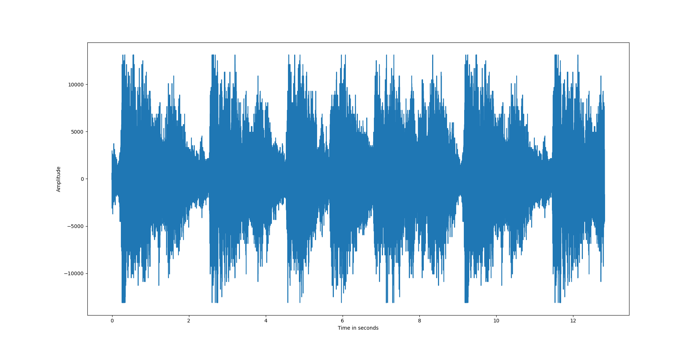

# PythonA2
# Audio Restoration using Median Filter and Cubic Spline method

## High-level Description of the project
This assignment builds on Assignment I. We assume that we have successfully detected the clicks and we are applying different interpolation methods to restore the audio, such as
- Median filtering - Med_filter.py
- Cubic splines - cubic_spline.py

---

## Installation and Execution

The first step is to create an environment. After creating an environment, we install the following libraries
```
numpy==1.23.4 
scikit_learn==1.1.3
matplotlib==3.6.2
tqdm==4.64.1
scipy==1.9.3 
playsound==1.2.2                             
pip3 install pipreqs
```
After installation, the files are run by 
```
python Med_filter.py
python cubic_spline.py
```
For more details check [here](https://github.com/bndr/pipreqs)

---

## Methodology and Results
The file Med_filter.py is the main script which calls different functions - `append_zeros`, `my_median`, `median`, `plot`, and a unittest main function `TestFilter`. 


**Results**

1. For the median filter, different lengths of filter were explored to test the effectiveness of the restoration. In particular, Six were tested and size = 3 was observed to deliver the lowest MSE, as shown in the figure below.


The restored waveform <output_medianFilter.wav> with the optimal filter length is given below:


2. Using the cubic splines, we observe that there are no clicks in the audio signal.

The restored waveform <output_cubicSplines.wav> with the optimal filter length is given below:


3. Comparing the two different interpolation methods, we notice that cubic spline achieves a lower MSE. The runtime of cubic spline is 0.089005 seconds and the runtime of median filter is 1.117534 seconds. 

After listening to the two restored files, we notice that the degraded signal is restored without an clicks using two interpolating methods.


---
## Credits

This code was developed for purely academic purposes by Shreya Uday Kumar Kodgi as part of the Computational Methods module Assignment.

Resources:
- [Cubic Spline](https://docs.scipy.org/doc/scipy/reference/generated/scipy.interpolate.CubicSpline.html)


